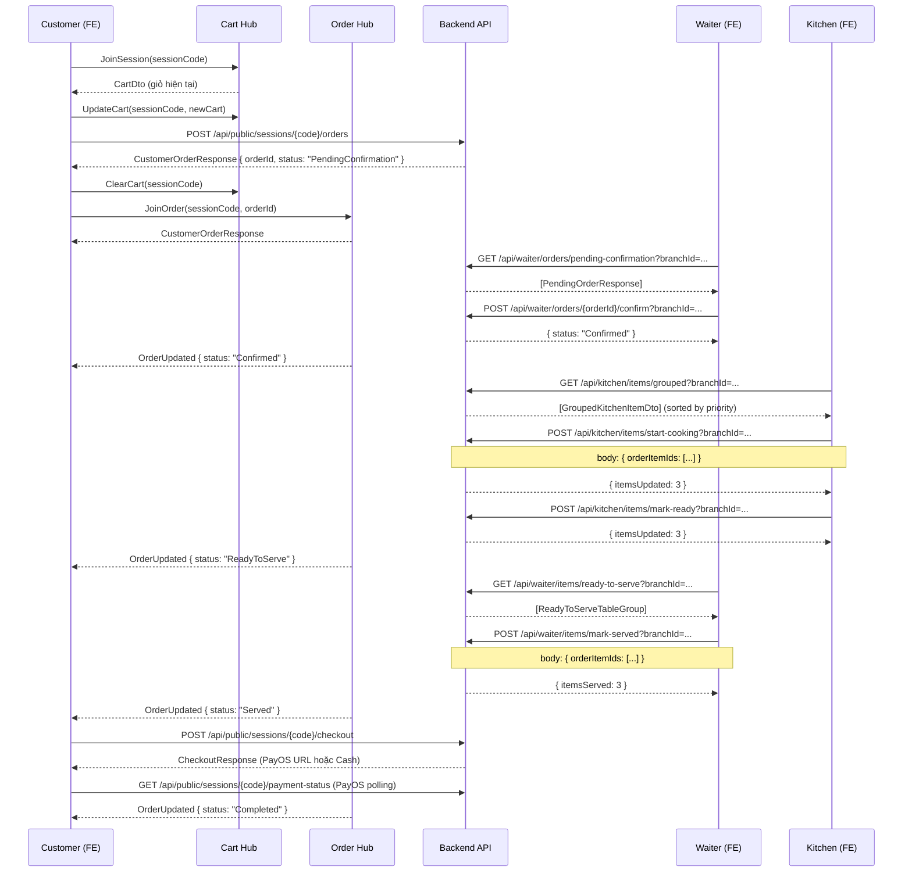

# Order Processing – API Reference cho Frontend

Tài liệu này mô tả toàn bộ các API liên quan đến chức năng đặt món và xử lý đơn hàng trong hệ thống ScanNow.

> **Base URL:** `process.env.NEXT_PUBLIC_API_URL` (đã được configure sẵn trong `axiosBasic`)
>
> **Response wrapper:** Mọi API đều trả về format:
> ```json
> { "message": "...", "result": <T> }
> ```
> mapping với type `ApiResponse<T>` hiện có trong `src/types/api.ts`.

---

## Mục lục

1. [Public APIs (Customer)](#1-public-apis-customer)
2. [Order APIs (Customer đặt món)](#2-order-apis-customer-đặt-món)
3. [Waiter APIs (Nhân viên phục vụ)](#3-waiter-apis-nhân-viên-phục-vụ)
4. [Kitchen APIs (Bếp)](#4-kitchen-apis-bếp)
5. [Shared Cart Hub (SignalR)](#5-shared-cart-hub-signalr)
6. [Types / Interfaces](#6-types--interfaces)
7. [Luồng nghiệp vụ tổng thể](#7-luồng-nghiệp-vụ-tổng-thể)

---

## 1. Public APIs (Customer)

Đây là các API không yêu cầu đăng nhập, được gọi từ màn hình Customer. Đã có sẵn trong `services/public-customer.ts`.

### GET `/api/public/tables/{qrCodeToken}`

Lấy thông tin bàn từ mã QR token (đã implement).

**Response:** `ApiResponse<PublicTableResponse>`

---

### POST `/api/public/sessions/join`

Tham gia phiên bàn bằng session code (đã implement).

**Request body:**
```typescript
{ sessionCode: string }  // 6 ký tự uppercase
```

**Response:** `ApiResponse<JoinSessionResponse>`

---

### GET `/api/public/sessions/{sessionCode}/menu`

Lấy menu của phiên (đã implement).

---

## 2. Order APIs (Customer đặt món)

### ▶️ POST `/api/public/sessions/{sessionCode}/orders`

Đặt món từ giỏ hàng chung. Đây là bước **chuyển giỏ hàng SignalR thành đơn hàng thật** trên database.

> **Khi nào gọi:** Khi customer bấm nút "Đặt món" / "Xác nhận đơn" sau khi đã chọn món trên giỏ hàng chung.

**URL Params:**
| Param | Mô tả |
|---|---|
| `sessionCode` | Session code của bàn (đã có trong `persistedSession.sessionCode`) |

**Request Body:**
```typescript
type PlaceOrderRequest = {
  customerName?: string | null;     // Tên khách (tùy chọn)
  customerPhone?: string | null;    // SĐT khách (tùy chọn)
  customerNote?: string | null;     // Ghi chú cho cả đơn hàng
  items: Array<{
    menuItemId: string;             // UUID của món ăn (từ PublicMenuItemResponse.menuItemId)
    quantity: number;               // Số lượng (≥ 1)
    note?: string | null;           // Ghi chú riêng cho từng món (VD: "ít cay", "không hành")
  }>;
};
```

**Ví dụ Request:**
```json
{
  "customerName": "Nguyễn Văn A",
  "customerNote": "Bàn 2 người, sinh nhật",
  "items": [
    {
      "menuItemId": "550e8400-e29b-41d4-a716-446655440000",
      "quantity": 2,
      "note": "ít cay"
    },
    {
      "menuItemId": "6ba7b810-9dad-11d1-80b4-00c04fd430c8",
      "quantity": 1,
      "note": null
    }
  ]
}
```

**Response:** `ApiResponse<CustomerOrderResponse>`
```typescript
type CustomerOrderResponse = {
  orderId: string;                  // UUID đơn hàng (cần lưu lại để join OrderHub)
  orderNumber: string;              // Mã đơn, VD: "ORD-20260524152301-ABC123"
  branchId: string;
  tableId: string | null;
  customerName: string | null;
  customerPhone: string | null;
  customerNote: string | null;
  subTotal: number;
  vatPercent: number;
  vatAmount: number;
  serviceChargePercent: number;
  serviceChargeAmount: number;
  totalAmount: number;
  status: OrderStatus;              // "PendingConfirmation" sau khi tạo
  orderSource: string;              // "QR"
  createdAt: string;                // ISO datetime
  updatedAt: string | null;         // ISO datetime của snapshot mới nhất
  items: CustomerOrderItemResponse[];
};

type CustomerOrderItemResponse = {
  orderItemId: string;
  menuItemId: string;
  menuItemName: string;
  unitPrice: number;
  quantity: number;
  subTotal: number;
  note: string | null;
  estimatedCookingMinutes: number;
};
```

**Lưu ý quan trọng:**
- Giá của mỗi món sẽ được **copy từ database** tại thời điểm đặt — FE không cần gửi giá.
- `EstimatedCookingMinutes` được copy từ `MenuItem.PreparationTime` — FE không cần gửi.
- Nếu session đã có đơn hàng active còn ở `PendingConfirmation`, các items mới được **gộp vào đơn hàng đó**.
- Sau khi đơn đã được xác nhận, yêu cầu gọi thêm món bị từ chối để không tạo item ngoài workflow xác nhận hiện tại.
- Sau khi đặt thành công, nên gọi `ClearCart` trên SignalR Hub để reset giỏ hàng chung.

---

### ▶️ GET `/api/public/sessions/{sessionCode}/orders/{orderId}`

Xem snapshot chi tiết đơn hàng của phiên. Endpoint xác minh session còn hiệu lực và đơn là active order của session; trạng thái tiếp theo được cập nhật realtime qua Order Hub.

**URL Params:**
| Param | Mô tả |
|---|---|
| `sessionCode` | Session code của bàn |
| `orderId` | UUID đơn hàng (lấy từ `PlaceOrderResponse.orderId`) |

**Response:** `ApiResponse<CustomerOrderResponse>` (cùng type với PlaceOrder)

---

### ▶️ POST `/api/public/sessions/{sessionCode}/checkout`

Tạo thanh toán cho đơn hàng (đã implement, gọi PayOS hoặc Cash).

**Request body:**
```typescript
{ paymentMethod: "PAYOS" | "CASH" }
```

---

### ▶️ GET `/api/public/sessions/{sessionCode}/payment-status`

Kiểm tra trạng thái thanh toán (đã implement, dùng để polling).

---

## 3. Waiter APIs (Nhân viên phục vụ)

> **Authorization:** Yêu cầu Bearer token với role `STAFF` hoặc `BRANCH_MANAGER`.

### ▶️ GET `/api/waiter/orders/pending-confirmation`

Lấy danh sách đơn hàng đang chờ waiter xác nhận.

**Query Params:**
| Param | Type | Mô tả |
|---|---|---|
| `branchId` | `string` (UUID) | ID chi nhánh của staff đang đăng nhập |

**Response:** `ApiResponse<PendingOrderResponse[]>`
```typescript
type PendingOrderResponse = {
  orderId: string;
  orderNumber: string;           // "ORD-20260524..."
  branchId: string;
  tableId: string | null;
  tableNumber: string | null;    // Số bàn, VD: "Bàn 05"
  customerName: string | null;
  customerPhone: string | null;
  customerNote: string | null;
  totalAmount: number;
  status: "PendingConfirmation";
  createdAt: string;
  items: Array<{
    orderItemId: string;
    menuItemId: string;
    menuItemName: string;
    unitPrice: number;
    quantity: number;
    subTotal: number;
    note: string | null;         // Ghi chú đặc biệt của món
    status: "Pending";
  }>;
};
```

---

### ▶️ POST `/api/waiter/orders/{orderId}/confirm`

Xác nhận đơn hàng. Chuyển trạng thái: `PendingConfirmation → Confirmed`, items `Pending → Confirmed`.

**URL Params:**
| Param | Mô tả |
|---|---|
| `orderId` | UUID đơn hàng |

**Query Params:**
| Param | Type | Mô tả |
|---|---|---|
| `branchId` | `string` (UUID) | ID chi nhánh để kiểm tra quyền |

**Response:** `ApiResponse<ConfirmOrderResponse>`
```typescript
type ConfirmOrderResponse = {
  orderId: string;
  orderNumber: string;
  status: "Confirmed";
  confirmedAt: string;           // ISO datetime
  itemsConfirmed: number;        // Số lượng item đã được confirm
};
```

**Lưu ý:**
- Sau khi confirm, tất cả items sẽ xuất hiện trên màn hình bếp.
- Chỉ có thể confirm đơn đang ở trạng thái `PendingConfirmation`.

---

### ▶️ GET `/api/waiter/items/ready-to-serve`

Lấy danh sách các món đã sẵn sàng phục vụ, được group theo bàn và đơn hàng.

**Query Params:**
| Param | Type | Mô tả |
|---|---|---|
| `branchId` | `string` (UUID) | ID chi nhánh |

**Response:** `ApiResponse<ReadyToServeTableGroup[]>`
```typescript
type ReadyToServeTableGroup = {
  tableId: string | null;
  tableNumber: string | null;    // "Bàn 05"
  orders: Array<{
    orderId: string;
    orderNumber: string;
    items: Array<{
      orderItemId: string;
      menuItemId: string;
      menuItemName: string;
      quantity: number;
      note: string | null;
      readyAt: string | null;    // Thời điểm bếp báo xong
    }>;
  }>;
};
```

**Ví dụ hiển thị trên UI:**
```
Bàn 01
  └── ORD-001
        ├── Cơm gà x2  (sẵn sàng lúc 19:32)
        └── Nước cam x1 (sẵn sàng lúc 19:33)

Bàn 03
  └── ORD-002
        └── Phở bò x1 (sẵn sàng lúc 19:30)
```

---

### ▶️ POST `/api/waiter/items/mark-served`

Đánh dấu các món đã được phục vụ (mang ra bàn xong).

**Query Params:**
| Param | Type | Mô tả |
|---|---|---|
| `branchId` | `string` (UUID) | ID chi nhánh để kiểm tra quyền |

**Request Body:**
```typescript
type MarkItemsServedRequest = {
  orderItemIds: string[];  // Danh sách UUID các orderItem cần mark Served
};
```

**Ví dụ Request:**
```json
{
  "orderItemIds": [
    "550e8400-e29b-41d4-a716-446655440001",
    "550e8400-e29b-41d4-a716-446655440002"
  ]
}
```

**Response:** `ApiResponse<MarkItemsServedResponse>`
```typescript
type MarkItemsServedResponse = {
  itemsServed: number;           // Số items đã được mark
  affectedOrderIds: string[];    // Danh sách orderId bị ảnh hưởng
};
```

**Lưu ý:**
- Chỉ mark được items đang ở trạng thái `Ready`.
- Sau khi tất cả items của một order đều `Served`, `Order.Status` tự động chuyển sang `Served`.

---

## 4. Kitchen APIs (Bếp)

> **Authorization:** Yêu cầu Bearer token với role `KITCHEN` hoặc `BRANCH_MANAGER`.

### ▶️ GET `/api/kitchen/items/grouped`

Lấy danh sách các món cần làm, **được gom nhóm theo tên món + ghi chú** để chef có thể làm hàng loạt.

**Query Params:**
| Param | Type | Mô tả |
|---|---|---|
| `branchId` | `string` (UUID) | ID chi nhánh |
| `status` | `"Confirmed"` \| `"Cooking"` | Lọc theo trạng thái (tùy chọn, mặc định lấy cả 2) |

**Response:** `ApiResponse<GroupedKitchenItemDto[]>`

Danh sách đã được **sắp xếp theo độ ưu tiên** (cao nhất trước).

```typescript
type GroupedKitchenItemDto = {
  menuItemId: string;
  menuItemName: string;              // "Cơm gà"
  status: "Confirmed" | "Cooking";
  note: string | null;               // Ghi chú chung. VD: "ít cay"
  totalQuantity: number;             // Tổng số phần cần làm
  averageCookingMinutes: number;     // Thời gian làm trung bình (phút)
  priorityScore: number;             // Điểm ưu tiên (số càng cao càng cần làm trước)
  suggestedPriorityLevel: "Low" | "Medium" | "High";
  oldestConfirmedAt: string | null;  // Thời điểm confirm của item chờ lâu nhất
  waitingMinutes: number;            // Số phút đang chờ (tính từ oldestConfirmedAt)
  items: GroupedKitchenOrderItemDto[];  // Chi tiết từng order chứa món này
};

type GroupedKitchenOrderItemDto = {
  orderItemId: string;               // Dùng để gọi start-cooking / mark-ready
  orderId: string;
  orderCode: string;                 // "ORD-20260524-ABC123"
  tableId: string | null;
  tableName: string | null;          // "Bàn 05"
  quantity: number;                  // Số phần trong order này
  note: string | null;
  status: "Confirmed" | "Cooking";
  confirmedAt: string | null;
  cookingStartedAt: string | null;
  estimatedCookingMinutes: number;
};
```

**Ví dụ Response:**
```json
[
  {
    "menuItemId": "uuid-1",
    "menuItemName": "Cơm gà",
    "status": "Confirmed",
    "note": "ít cay",
    "totalQuantity": 6,
    "averageCookingMinutes": 12,
    "priorityScore": 89.5,
    "suggestedPriorityLevel": "High",
    "oldestConfirmedAt": "2026-05-24T19:01:00Z",
    "waitingMinutes": 8.2,
    "items": [
      {
        "orderItemId": "uuid-item-1",
        "orderCode": "ORD-001",
        "tableName": "Bàn 01",
        "quantity": 2,
        "note": "ít cay",
        "status": "Confirmed",
        "confirmedAt": "2026-05-24T19:01:00Z",
        "estimatedCookingMinutes": 12
      },
      {
        "orderItemId": "uuid-item-2",
        "orderCode": "ORD-003",
        "tableName": "Bàn 05",
        "quantity": 4,
        "note": "ít cay",
        "status": "Confirmed",
        "confirmedAt": "2026-05-24T19:03:00Z",
        "estimatedCookingMinutes": 12
      }
    ]
  }
]
```

**Gợi ý hiển thị trên Chef Screen:**
```
[HIGH] Cơm gà "ít cay" — 6 phần — Đợi 8 phút — Nấu ~12 phút
  - Bàn 01 / ORD-001: x2
  - Bàn 05 / ORD-003: x4
  [Bắt đầu nấu]  [Đã xong]
```

---

### ▶️ POST `/api/kitchen/items/start-cooking`

Bắt đầu nấu các món đã chọn. Chuyển trạng thái: `Confirmed → Cooking`.

**Query Params:**
| Param | Type | Mô tả |
|---|---|---|
| `branchId` | `string` (UUID) | ID chi nhánh để kiểm tra quyền |

**Request Body:**
```typescript
type StartCookingRequest = {
  orderItemIds: string[];  // Danh sách UUID orderItemId cần bắt đầu nấu
};
```

> ⚠️ **Quan trọng:** FE phải gửi **từng `orderItemId` riêng lẻ** (lấy từ `GroupedKitchenOrderItemDto.orderItemId`), không phải `menuItemId`. Nếu muốn bắt đầu toàn bộ nhóm "Cơm gà ít cay", cần gửi tất cả `orderItemId` trong `items[]` của nhóm đó.

**Response:** `ApiResponse<StartCookingResponse>`
```typescript
type StartCookingResponse = {
  itemsUpdated: number;
  affectedOrderIds: string[];
};
```

**Lỗi có thể gặp:**
- `400`: Items không ở trạng thái `Confirmed` (đã được chef khác bắt đầu)
- `403`: Items không thuộc chi nhánh của bạn
- `404`: Một hoặc nhiều `orderItemId` không tồn tại

---

### ▶️ POST `/api/kitchen/items/mark-ready`

Đánh dấu các món đã nấu xong, sẵn sàng phục vụ. Chuyển: `Cooking → Ready`.

**Query Params:**
| Param | Type | Mô tả |
|---|---|---|
| `branchId` | `string` (UUID) | ID chi nhánh để kiểm tra quyền |

**Request Body:**
```typescript
type MarkReadyRequest = {
  orderItemIds: string[];
};
```

**Response:** `ApiResponse<MarkReadyResponse>`
```typescript
type MarkReadyResponse = {
  itemsUpdated: number;
  affectedOrderIds: string[];
};
```

**Lỗi có thể gặp:**
- `400`: Items không ở trạng thái `Cooking`
- `403`: Items không thuộc chi nhánh của bạn

---

## 5. Shared Cart Hub (SignalR)

Kết nối tại `/hubs/cart`. Xem file `CartHub_Integration_Guide.md` để biết chi tiết.

### Luồng: Đặt món từ Giỏ hàng chung

```
1. FE kết nối Hub → invoke("JoinSession", sessionCode)
2. Người dùng chọn món → invoke("UpdateCart", sessionCode, cartDto)
3. Người dùng bấm "Đặt món":
   a. Gọi POST /api/public/sessions/{sessionCode}/orders
   b. Nếu thành công → invoke("ClearCart", sessionCode) để reset giỏ chung
4. Lưu orderId từ response để tracking
```

### Customer Order Status Hub

Kết nối tại `/hubs/orders`. Xem file `OrderHub_Integration_Guide.md` để biết chi tiết.

- `JoinOrder(sessionCode, orderId)` xác minh order thuộc session và trả `CustomerOrderResponse` hiện tại.
- `OrderUpdated` đẩy `CustomerOrderResponse` sau khi waiter, kitchen hoặc thanh toán thay đổi trạng thái.
- `LeaveOrder(orderId)` rời nhóm khi đóng trang theo dõi.
- Hub public không gửi `OrderItemStatus`; khách chỉ theo dõi `OrderStatus`.

---

## 6. Types / Interfaces

Đề xuất thêm vào `src/types/` để FE implement:

```typescript
// src/types/order.ts

export type OrderStatus =
  | "PendingConfirmation"
  | "Confirmed"
  | "Preparing"
  | "PartiallyReady"
  | "ReadyToServe"
  | "PartiallyServed"
  | "Served"
  | "Completed"
  | "Cancelled";

export type OrderItemStatus =
  | "Pending"
  | "Confirmed"
  | "Cooking"
  | "Ready"
  | "Served"
  | "Cancelled";

export type CustomerOrderItemResponse = {
  orderItemId: string;
  menuItemId: string;
  menuItemName: string;
  unitPrice: number;
  quantity: number;
  subTotal: number;
  note: string | null;
  estimatedCookingMinutes: number;
};

export type CustomerOrderResponse = {
  orderId: string;
  orderNumber: string;
  branchId: string;
  tableId: string | null;
  customerName: string | null;
  customerPhone: string | null;
  customerNote: string | null;
  subTotal: number;
  vatPercent: number;
  vatAmount: number;
  serviceChargePercent: number;
  serviceChargeAmount: number;
  totalAmount: number;
  status: OrderStatus;
  orderSource: string;
  createdAt: string;
  updatedAt: string | null;
  items: CustomerOrderItemResponse[];
};

export type PlaceOrderItemRequest = {
  menuItemId: string;
  quantity: number;
  note?: string | null;
};

export type PlaceOrderRequest = {
  customerName?: string | null;
  customerPhone?: string | null;
  customerNote?: string | null;
  items: PlaceOrderItemRequest[];
};

// --- Waiter Types ---

export type PendingOrderItemResponse = {
  orderItemId: string;
  menuItemId: string;
  menuItemName: string;
  unitPrice: number;
  quantity: number;
  subTotal: number;
  note: string | null;
  status: OrderItemStatus;
};

export type PendingOrderResponse = {
  orderId: string;
  orderNumber: string;
  branchId: string;
  tableId: string | null;
  tableNumber: string | null;
  customerName: string | null;
  customerPhone: string | null;
  customerNote: string | null;
  totalAmount: number;
  status: OrderStatus;
  createdAt: string;
  items: PendingOrderItemResponse[];
};

export type ConfirmOrderResponse = {
  orderId: string;
  orderNumber: string;
  status: OrderStatus;
  confirmedAt: string | null;
  itemsConfirmed: number;
};

export type ReadyToServeItemResponse = {
  orderItemId: string;
  menuItemId: string;
  menuItemName: string;
  quantity: number;
  note: string | null;
  readyAt: string | null;
};

export type ReadyToServeOrderGroup = {
  orderId: string;
  orderNumber: string;
  items: ReadyToServeItemResponse[];
};

export type ReadyToServeTableGroup = {
  tableId: string | null;
  tableNumber: string | null;
  orders: ReadyToServeOrderGroup[];
};

export type MarkItemsServedRequest = {
  orderItemIds: string[];
};

export type MarkItemsServedResponse = {
  itemsServed: number;
  affectedOrderIds: string[];
};

// --- Kitchen Types ---

export type GroupedKitchenOrderItemDto = {
  orderItemId: string;
  orderId: string;
  orderCode: string;
  tableId: string | null;
  tableName: string | null;
  quantity: number;
  note: string | null;
  status: OrderItemStatus;
  confirmedAt: string | null;
  cookingStartedAt: string | null;
  estimatedCookingMinutes: number;
};

export type GroupedKitchenItemDto = {
  menuItemId: string;
  menuItemName: string;
  status: OrderItemStatus;
  note: string | null;
  totalQuantity: number;
  averageCookingMinutes: number;
  priorityScore: number;
  suggestedPriorityLevel: "Low" | "Medium" | "High";
  oldestConfirmedAt: string | null;
  waitingMinutes: number;
  items: GroupedKitchenOrderItemDto[];
};

export type StartCookingRequest = {
  orderItemIds: string[];
};

export type StartCookingResponse = {
  itemsUpdated: number;
  affectedOrderIds: string[];
};

export type MarkReadyRequest = {
  orderItemIds: string[];
};

export type MarkReadyResponse = {
  itemsUpdated: number;
  affectedOrderIds: string[];
};
```

---

## 7. Luồng nghiệp vụ tổng thể



### Bảng trạng thái đơn hàng

| `Order.Status` | Ý nghĩa | Hành động tiếp theo |
|---|---|---|
| `PendingConfirmation` | Khách vừa đặt, chờ waiter xác nhận | Waiter → Confirm |
| `Confirmed` | Waiter đã xác nhận, xuất hiện trên bếp | Chef → Start Cooking |
| `Preparing` | Bếp đang làm ít nhất 1 món | Chef → Mark Ready |
| `PartiallyReady` | Một số món xong, số còn lại đang làm | Chef → Mark Ready phần còn lại |
| `ReadyToServe` | Tất cả món đã xong | Waiter → Mark Served |
| `PartiallyServed` | Một số món đã mang ra, số còn lại chưa | Waiter → Mark Served phần còn lại |
| `Served` | Tất cả món đã mang ra bàn | → Thanh toán |
| `Completed` | Đã thanh toán xong | — |
| `Cancelled` | Đơn bị hủy | — |

### Bảng trạng thái món ăn (OrderItem)

| `OrderItem.Status` | Ý nghĩa |
|---|---|
| `Pending` | Chờ waiter xác nhận |
| `Confirmed` | Đã confirm, chờ bếp làm |
| `Cooking` | Bếp đang làm |
| `Ready` | Xong, chờ phục vụ |
| `Served` | Đã mang ra bàn |
| `Cancelled` | Bị hủy |
